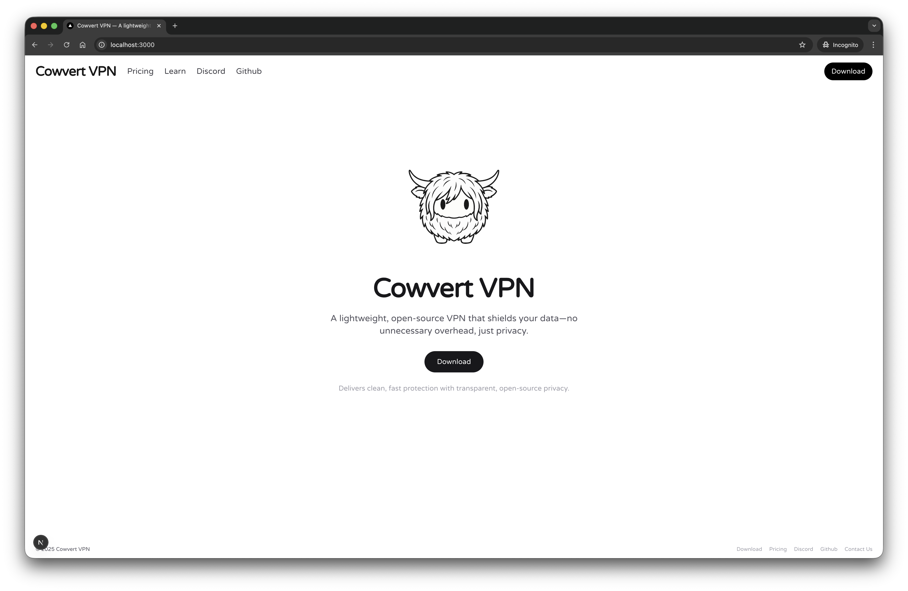

<p align="center">
  
</p>

# 🐮 Cowvert VPN — UI Concept

[](https://github.com/daw99y/cowvert-vpn) [](https://github.com/daw99y/cowvert-vpn)

Cowvert VPN is a **conceptual VPN product interface** for a fictional, privacy‑first VPN brand.  
It is designed to showcase **modern UI**, **product storytelling**, and **front‑end craft**, not to provide a real VPN service.  
There is **no functional VPN backend, networking, encryption, or actual connection system** in this project.

---

## Overview

Cowvert explores what a polished VPN experience could look and feel like if it were built from the ground up with clarity, personality, and trust in mind.  
The project focuses on **interface design**, **micro-interactions**, and **responsive layouts** that support a strong product narrative.  
Under the hood it is a standard Next.js front-end — there is **no real tunneling, encryption, or secure networking** implemented.

---

## Live Preview

- Demo coming soon
- Planned: hosted preview via Vercel

---

## Features

- **Clean, minimal UX**: Focused layouts that keep controls simple and readable across devices.
- **Onboarding flow**: Concept screens for welcoming users, explaining value, and guiding first setup.
- **Global server UI**: A visual list of regions and cities, with **flag-based server selection** for quick scanning.
- **Fake plan system**: Lifetime / free plan concepts for showcasing pricing UI and CTAs (no real billing).
- **Prototype-level interactions**: Smooth transitions, hover states, and affordances tuned for a polished feel.
- **Cow-themed branding**: Playful branding and visual details to keep the concept memorable and fun.

---

## Tech Stack

- **Next.js 14** – App Router and modern React features.
- **React 19** – Functional components and hooks.
- **TypeScript** – Safer, more maintainable front-end code.
- **Tailwind CSS** – Utility-first styling for fast, consistent UI.
- **Framer Motion** – Animations and micro-interactions (where appropriate).
- **Spline 3D** (optional) – 3D scenes or models to support the Cowvert brand.
- **Vercel** (planned) – Zero-config deployment and previews.

> Note: The stack is used purely for the **front-end experience**. There is **no VPN protocol or cryptography layer** implemented here.

---

## Status

- **UI/UX prototype only** – built for design and storytelling.
- **No working VPN logic** – no tunneling, encryption, or traffic routing.
- **Placeholder actions** – buttons, download links, and purchase flows are **non-functional** and exist only to illustrate product flows.
- **Not a security product** – do not rely on this project for privacy, security, or networking.

---

## Folder Structure

A simplified view of the main structure:

```text
app/
  page.tsx           # Landing / main experience
  learn/             # Education / onboarding & product storytelling
  pricing/           # Conceptual pricing / plans
  components/        # Section-level UI (onboarding, servers, CTA, etc.)

components/
  Header.tsx         # Global navigation
  Footer.tsx         # Site footer
  SearchInput.tsx    # Reusable search UI

public/
  images/            # Branding assets, logos, and illustrations
  videos/            # Concept motion / logo animations
  icons / svg        # UI icons and decorative assets
```

The exact implementation may evolve, but the goal is to keep the structure **readable and easy to navigate** for designers and developers reviewing the code.

---

## Setup

No backend, API keys, or server configuration is required — this is a pure front-end prototype.

### 1. Clone the repo

```bash
git clone https://github.com/daw99y/cowvert-vpn.git
cd cowvert-vpn
```

### 2. Install dependencies

Using **pnpm**:

```bash
pnpm install
```

Or with **npm**:

```bash
npm install
```

### 3. Run the development server

Using **pnpm**:

```bash
pnpm dev
```

Or with **npm**:

```bash
npm run dev
```

Then open `http://localhost:3000` in your browser.  
You should see the Cowvert VPN concept UI — all interactions are **front-end only**.

---

## Screenshots

Screenshots and UI captures will be added here in a future update:

- High-level landing page overview
- Onboarding / learn flow
- Global server selection view
- Pricing / plan concept screens

If you are reviewing this repo, feel free to run it locally to explore the full experience.

---

## License

This project is released under the **MIT License**.  
You are welcome to explore, learn from, and adapt parts of this concept, but please do not market it as a real VPN or security product.

---

## Under the Hood

Cowvert VPN was created as a **portfolio piece** to demonstrate:

- **Product vision** – shaping a fictional VPN into a coherent, trustworthy product story.
- **UI development** – building responsive, accessible, and well-structured React/Next.js interfaces.
- **Interaction design** – motion, states, and flows that feel purposeful rather than flashy.

It is **not** an actual VPN service, security tool, or commercial offering.  
If you’d like to discuss the design or implementation details, or how this approach could translate to your product, feel free to reach out.
